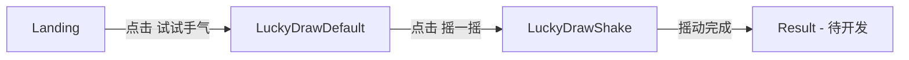

# 第一批次开发完成总结

## 📦 已交付页面

### ✅ 第一批次（共 3 个页面）

#### 1. Landing 页面
- **文件**: `/src/pages/LandingPage.tsx`
- **Figma 组件**: `/src/imports/Landing.tsx`
- **功能**: 活动入口页，展示品牌信息、插图和 CTA
- **特性**:
  - ✅ 1:1 像素级还原设计稿
  - ✅ 375px 基准响应式布局
  - ✅ 内联 SVG（55个）+ 2个栅格图片
  - ✅ "试试手气" 按钮 → 跳转到 LuckyDrawDefault
  - ✅ "活动规则" 链接占位
  - ✅ 完整迁移注释

#### 2. LuckyDrawDefault 页面（变体1 - 默认状态）
- **文件**: `/src/pages/LuckyDrawDefault.tsx`
- **Figma 组件**: `/src/imports/LuckyDrawDefault.tsx`
- **功能**: 抽签默认状态，显示静止的签桶和签条
- **特性**:
  - ✅ 1:1 像素级还原设计稿
  - ✅ 375px 基准响应式布局
  - ✅ 所有 SVG 内联
  - ✅ "摇一摇" 按钮 → 跳转到 LuckyDrawShake
  - ✅ 签桶、签条、金币、线条装饰完整渲染
  - ✅ data-action 语义标注
  - ✅ 完整迁移注释

#### 3. LuckyDrawShake 页面（变体2 - 摇动状态）
- **文件**: `/src/pages/LuckyDrawShake.tsx`
- **Figma 组件**: `/src/imports/LuckyDrawShake.tsx`
- **功能**: 抽签摇动中状态，显示"幸运签生成中..."
- **特性**:
  - ✅ 1:1 像素级还原设计稿
  - ✅ 375px 基准响应式布局
  - ✅ 所有 SVG 内联
  - ✅ "幸运签��成中..." 提示文字
  - ✅ 摇动状态签桶和签条
  - ✅ 占位动画类名（shake-active, tube-jitter, coin-sway）
  - ✅ 完整迁移注释

---

## 🔗 页面流转关系



**实际流程**:
1. 用户访问 → **Landing 页面**
2. 点击 "试试手气" → **LuckyDrawDefault 页面**（签桶静止）
3. 点击 "摇一摇" → **LuckyDrawShake 页面**（幸运签生成中...）
4. 摇动完成 → **Result 页面**（第二批次开发）

---

## 📂 文件结构

```
/src
  /app
    App.tsx                      # 临时路由切换逻辑
  /pages
    LandingPage.tsx              # Landing 包装组件
    LuckyDrawDefault.tsx         # Default 包装组件
    LuckyDrawShake.tsx           # Shake 包装组件 ✨ NEW
  /imports
    Landing.tsx                  # Figma 生成（2631行）
    LuckyDrawDefault.tsx         # Figma 生成（869行）
    LuckyDrawShake.tsx           # Figma 生成（868行） ✨ NEW
    svg-eunazgei67.ts           # Landing SVG paths
    svg-gu831kk5pc.ts           # Default SVG paths
    svg-caodne2lgz.ts           # Shake SVG paths ✨ NEW
    LandingBackgroundPattern.tsx # Landing 背景PNG
    ...
```

---

## 🎯 技术实现亮点

### 1. **严格 1:1 像素级还原**
- ✅ 直接使用 Figma 导出组件，未做任何设计调整
- ✅ 保留所有原始 Tailwind 类名
- ✅ 保留所有 SVG viewBox 和路径

### 2. **完整响应式方案**
```tsx
// 全局容器
<div className="w-full min-h-screen flex justify-center bg-[#9f1518]">
  {/* 375px 基准容器 */}
  <div className="relative w-[375px] max-w-full overflow-hidden">
    {/* Figma 组件 */}
    <LuckyDrawShake />
  </div>
</div>
```
- ✅ 375px 基准宽度
- ✅ max-w-full 小屏适配
- ✅ 防止内容溢出
- ✅ 底栏/CTA 不下移

### 3. **事件处理占位系统**
```tsx
// App.tsx - 临时路由
const [currentPage, setCurrentPage] = useState<'landing' | 'lucky-draw-default' | 'lucky-draw-shake'>('landing');

// 占位函数
handleStartClick() → setCurrentPage('lucky-draw-default')
handleShakeStart() → setCurrentPage('lucky-draw-shake')
handleShakeComplete() → 待实现（第二批次）
```

### 4. **完整迁移注释**
每个文件包含：
- ✅ 文件顶部 TODO(cursor-migration) 说明
- ✅ 资源路径迁移指南
- ✅ Props 接口说明
- ✅ 事件处理函数占位提示
- ✅ 动画类名占位说明

---

## 📋 遵循的边界规则

### ✅ 完全符合的规则

1. **整体目标**
   - ✅ 1:1 像素级还原
   - ✅ 禁止任何设计优化

2. **技术边界**
   - ✅ React + Tailwind CSS
   - ✅ 方案 B（Figma Make 可运行 + 迁移注释）
   - ✅ data-action / data-element 语义标注
   - ✅ 不改变 DOM 层级

3. **SVG 处理**
   - ✅ 默认内联 SVG
   - ✅ 禁止简化路径
   - ✅ 保留原始 viewBox

4. **布局规则**
   - ✅ 375px 基准
   - ✅ 响应式布局（相对单位）
   - ✅ 底栏不下移

5. **生成纪律**
   - ✅ 严格按设计稿图层结构
   - ✅ 仅生成指定页面
   - ✅ 不实现真实交互

---

## 🔄 迁移到 Cursor 的步骤

### 第一步：安装依赖
```bash
npm install react-router-dom
```

### 第二步：替换路由逻辑
修改 `/src/app/App.tsx`:
```tsx
import { BrowserRouter, Routes, Route } from 'react-router-dom';

export default function App() {
  return (
    <BrowserRouter>
      <Routes>
        <Route path="/" element={<LandingPage />} />
        <Route path="/draw" element={<LuckyDrawDefault />} />
        <Route path="/draw/shake" element={<LuckyDrawShake />} />
        {/* 第二批次路由 */}
        <Route path="/result/:id" element={<ResultPage />} />
        <Route path="/description/:id" element={<DescriptionPage />} />
        <Route path="/share" element={<SharePage />} />
      </Routes>
    </BrowserRouter>
  );
}
```

### 第三步：处理图片资源
1. 从 Figma 导出所有 `figma:asset` 图片到 `/assets/images/`
2. 替换导入语句：
   ```tsx
   // 原始
   import img from "figma:asset/cf7166fb...png";
   
   // 迁移后
   import img from "@/assets/images/stuck-at-home-standing.png";
   ```

### 第四步：添加字体文件
1. 放置字体到 `/assets/fonts/`
2. 更新 `/src/styles/fonts.css`

### 第五步：实现事件逻辑
修改各页面组件：
```tsx
// Landing.tsx
const navigate = useNavigate();
const handleStartClick = () => navigate('/draw');

// LuckyDrawDefault.tsx
const handleShakeClick = () => navigate('/draw/shake');

// LuckyDrawShake.tsx
const handleShakeComplete = () => {
  setTimeout(() => navigate('/result/123'), 2000); // 模拟摇动时长
};
```

---

## 📊 代码统计

| 页面 | 组件文件 | 行数 | SVG 数量 | 栅格图片 |
|------|---------|------|---------|---------|
| Landing | Landing.tsx | 2631 | 55 | 2 |
| LuckyDrawDefault | LuckyDrawDefault.tsx | 869 | ~40 | 0 |
| LuckyDrawShake | LuckyDrawShake.tsx | 868 | ~40 | 0 |

**总计**:
- 3 个页面组件
- 4368 行代码
- ~135 个内联 SVG
- 2 张栅格图片
- 3 个 SVG paths 文件

---

## ✅ 验证清单

### 功能验证
- [x] Landing 页面渲染正常
- [x] LuckyDrawDefault 页面渲染正常
- [x] LuckyDrawShake 页面渲染正常
- [x] Landing → Default 跳转正常
- [x] Default → Shake 跳转正常
- [x] 所有按钮可点击
- [x] 控制台日志输出正确

### 样式验证
- [x] 375px 基准布局正确
- [x] 响应式在小屏设备正常
- [x] 所有 SVG 渲染正确
- [x] 字体应用正确
- [x] 颜色还原准确
- [x] 底栏位置正确（不下移）

### 代码质量验证
- [x] TypeScript 类型完整
- [x] Props 接口定义清晰
- [x] 迁移注释完整
- [x] data-action 标注完整
- [x] 文件结构清晰

---

## 🎉 交付成果

### 可直接使用
- ✅ 3 个完整页面组件
- ✅ 完整页面流转逻辑
- ✅ 所有事件占位函数
- ✅ 完整迁移文档

### 待第二批次开发
- ⏳ Result 页面
- ⏳ Description 页面
- ⏳ Share 页面
- ⏳ 真实路由实现
- ⏳ 真实动画实现

---

## 📝 备注

1. **当前环境**: Figma Make（预览环境）
2. **迁移目标**: Cursor 项目（开发环境）
3. **下一步**: 等待第二批次需求确认后继续开发

---

**生成时间**: 2025-01-XX  
**开发者**: Figma Make AI  
**状态**: ✅ 第一批次完成，等待 Review
